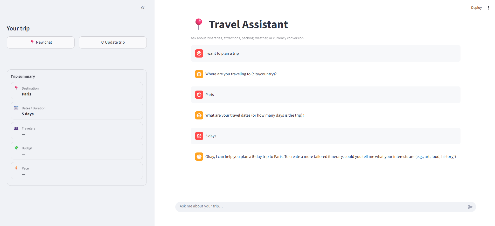
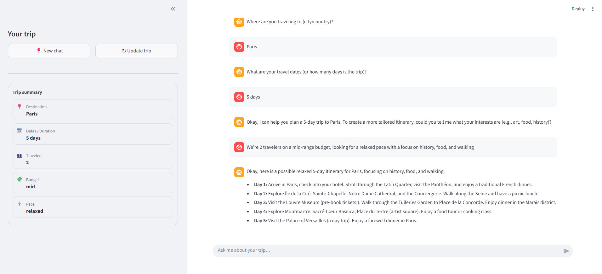
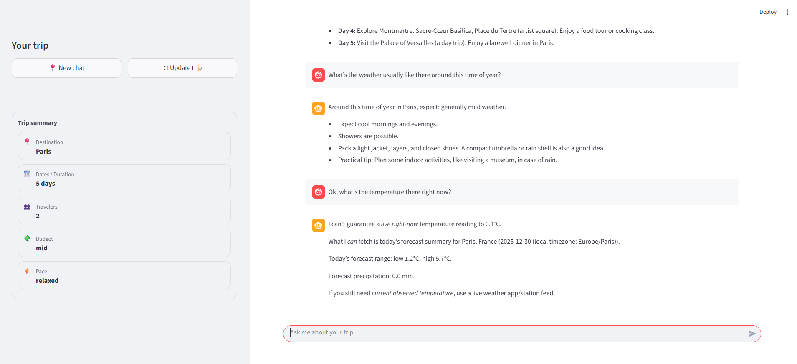
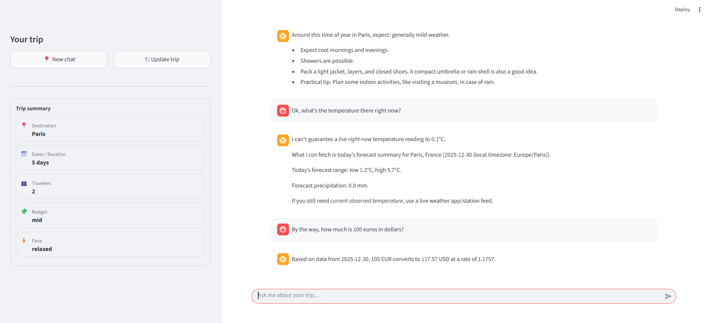

# Travel Assistant

## Project Overview

A conversational travel assistant that helps plan trips, answer weather questions,
and perform currency conversions using a large language model and external APIs.

The system supports multi-turn conversations and uses explicit decision logic
to choose between model reasoning and API calls.

---

## Supported Queries

- Trip and itinerary planning  
- Attraction recommendations  
- Packing lists  
- Weather questions
- Currency conversion  
- Follow-up questions and constraint updates  

---

## LLM and External APIs

LLM:
- Google Gemini

External APIs:
- Open-Meteo for weather forecasts  
- Currency exchange API for date-based rates  

---

## Interfaces

- **CLI**: conversational interaction via terminal
- **REST API** (FastAPI): programmatic access
- **Streamlit UI**: interactive visual demo

---

## Demo Screenshots

Selected screenshots from the Streamlit UI demonstrating core behaviors.
Full conversational flows are available in `docs/transcripts.md`.






---

## How to Run

### Run the CLI
Runs the assistant locally without a web interface.
```bash
python cli.py
```

### Run the API
Starts an HTTP server exposing a `/chat` endpoint.
```bash
uvicorn backend.main:app --reload --port 8000
```

### Run the UI (Optional)
Launches a Streamlit web interface for interactive demos.
```bash
streamlit run ui/streamlit_app.py
```

---

## Conversation Transcripts

Example conversations demonstrating context continuity, API usage,
and hallucination handling are available in: `docs/transcripts.md`